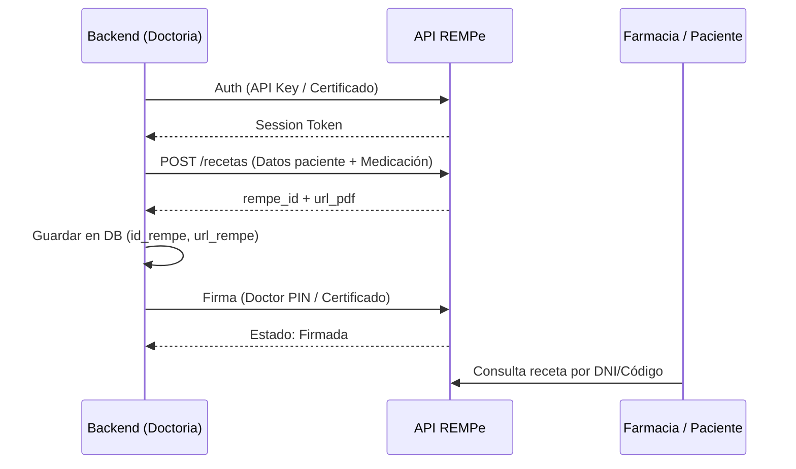

# Guía Técnica: Integración con API REMPe

Esta guía detalla cómo integrar la plataforma DOCTORIA con **REMPe** para la gestión de receta electrónica médica privada.

## 📡 Arquitectura de Integración

La comunicación se realiza mediante una API REST protegida por certificados digitales y/o tokens de acceso.



## 🛠 Pasos de Implementación (Node.js/Next.js)

### 1. Variables de Entorno
Asegúrate de tener las credenciales en `.env.local`:
```bash
REMPE_API_KEY=your_api_key
REMPE_BASE_URL=https://api.rempe.es/v1
REMPE_CERT_PATH=./certs/medico_cert.p12
```

### 2. Creación de Receta
```typescript
async function createRempePrescription(data: any) {
  const response = await fetch(`${process.env.REMPE_BASE_URL}/prescriptions`, {
    method: 'POST',
    headers: {
      'Authorization': `Bearer ${token}`,
      'Content-Type': 'application/json'
    },
    body: JSON.stringify({
      patient: { dni: data.dni, name: data.name },
      medicines: data.medicines,
      doctor: data.doctor_id
    })
  });
  return await response.json();
}
```

### 3. Estados de Receta en DB
Mapearemos los estados de REMPe a nuestra tabla `recetas`:
- `0`: Creada
- `1`: Firmada
- `2`: Dispensada
- `3`: Cancelada

## 🔒 Seguridad
- **Cifrado en tránsito:** Toda petición debe usar TLS 1.2+.
- **Firma Delegada:** Si DOCTORIA firma en nombre del médico, se requiere autorización explícita y custodia segura del certificado.
- **RGPD:** No enviar datos innecesarios a la API. REMPe cumple con normativas de salud.
